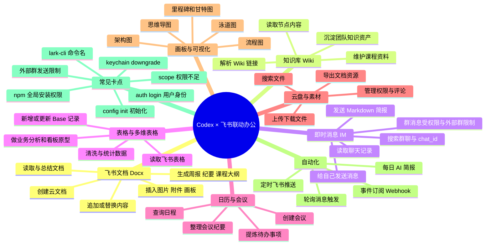

<title>C1 基础办公：Codex + 飞书 协同办公</title>

**前言**

**2026 年 4 月 16 日**，我的校外导师 Marc 在公司内做了一次分享，主题是他最近一个多月探索的 **WorkBuddy + Obsidian 知识管理模式**。听完之后，我当时很好奇地问了他一个问题：为什么不用飞书，而要重新选择 Obsidian？

他给我的一个回答让我印象很深：**飞书里的内容，不太方便被 AI Agent 读取和修改。**

**2026 年 3 月 28 日，飞书 CLI 的开源引起热议。**

<grid>
<column width-ratio="0.458470">

</column>
<column width-ratio="0.541530">

</column>
</grid>

在过去的非 AI 时代，飞书已经是非常优秀的企业协作工具。它解决的是**人与人之间**的信息流转：大家可以在飞书里聊天、开会、写文档、做表格、推进项目。它的核心价值，是让组织内部的人可以更高效地协同办公。

但到了 **AI Agent 时代，协作关系正在发生变化**。企业内部的协作对象不再只有“人”，还会逐渐加入各种 AI Agent，比如 Codex、Claude Code、WorkBuddy 等。

这时候，一个新的问题就出现了：**如果 AI Agent 不能方便地读取飞书里的文档、表格、会议纪要和项目资料，也不能安全、稳定地修改这些内容，那么飞书就很难真正成为 AI 办公时代的工作入口。**

飞书需要解决**人与 AI Agent** 之间的交互。飞书 CLI 它背后的意义，不只是多了一个开发者工具，而是飞书开始补齐面向 AI Agent 的基础设施。

**AI Agent + 飞书 这是一个巨大的AI应用场景。**

# 飞书CLI是什么？

**飞书新推出的命令行工具（CLI），让AI Agent能直接操作飞书，实现自动化办公**。简单来说，就是**给AI一个“遥控器”，让它帮你发消息、查日程、写文档、整理会议纪要等**。

# 展示案例

## ✅ 读取现有飞书文档，进行内容的增添删改

<grid>
<column width-ratio="0.457798">

</column>
<column width-ratio="0.542202">

</column>
</grid>

## ✅直接创建云文档内容

<grid>
<column width-ratio="0.499115">

</column>
<column width-ratio="0.500885">

</column>
</grid>

## ✅ 每日定时发送AI新闻

<grid>
<column width-ratio="0.543607">

</column>
<column width-ratio="0.456393">

</column>
</grid>

## ✅ 飞书联动能力思维导图

**需要另外安装飞书官方新发布的1个skill，参考 小红书博主 @张咋啦 的视频**

**以下内容为codex直接生成并贴入：**

下面这张思维导图梳理了 Codex 与飞书联动后可以覆盖的主要办公场景、自动化能力和常见配置卡点。

# 如何安装飞书CLI? （具体见<cite doc-id="KxERw8P5lim5cIkX6LUcg4a7nIe" file-type="wiki" title="Codex 联动飞书 CLI 安装教程" type="doc"></cite>）

安装和配置是关键，通常分为三步：

1. **安装工具：让你的AI Agent工具（如 codex）执行安装命令`npm install -g @larksuite/cli `（如果不行的话，可以在自己的终端上安装）**

1. 配置授权：安装后，AI会引导你执行 `lark-cli config init` 命令，这会生成一个二维码，用飞书App扫码即可完成授权。

<grid>
<column width-ratio="0.537493">

</column>
<column width-ratio="0.462507">

**飞书扫码授权之后，再问 Codex 是否成功连接**
如果没有，可以在终端运行这一行代码
`lark-cli config init --new`
</column>
</grid>

**连接成功之后，你可以问 Codex 它如何和飞书进行联动？**

# 如何使用？（具体见<cite doc-id="RQL4d6ySVopVLgxXwLBc0K5HnAg" file-type="docx" title="飞书如何与 Codex 联动办公" type="doc"></cite>）

**授权成功后，你就可以直接用自然语言指令让AI帮你操作飞书了，比如“帮我查看今天的日程”或“把这段会议录音整理成纪要”。**

## **⚠️ 让 Codex 以 user 身份创建**

<grid>
<column width-ratio="0.482412">

</column>
<column width-ratio="0.517588">

</column>
</grid>
